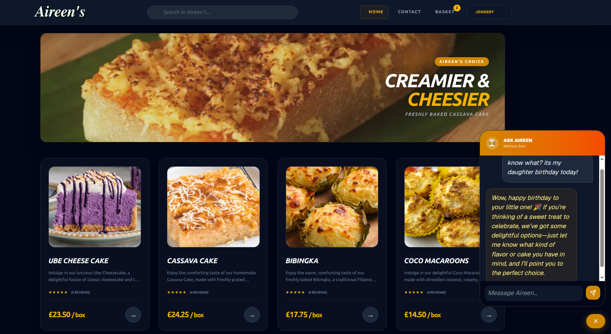
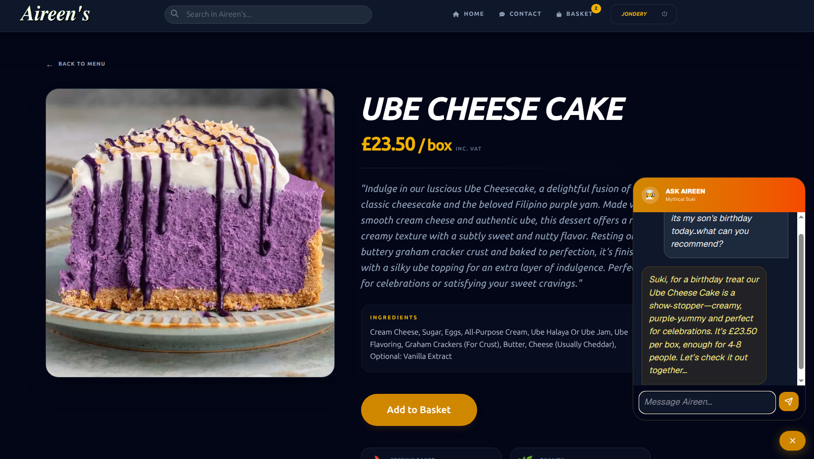
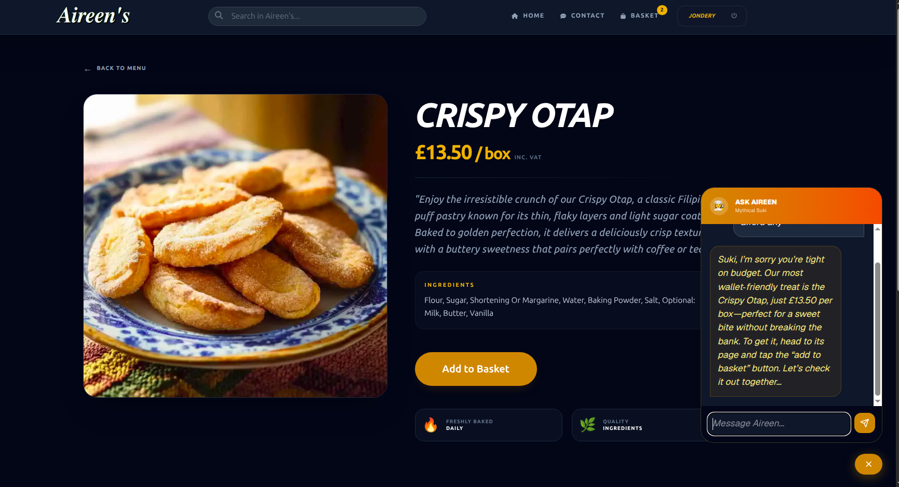
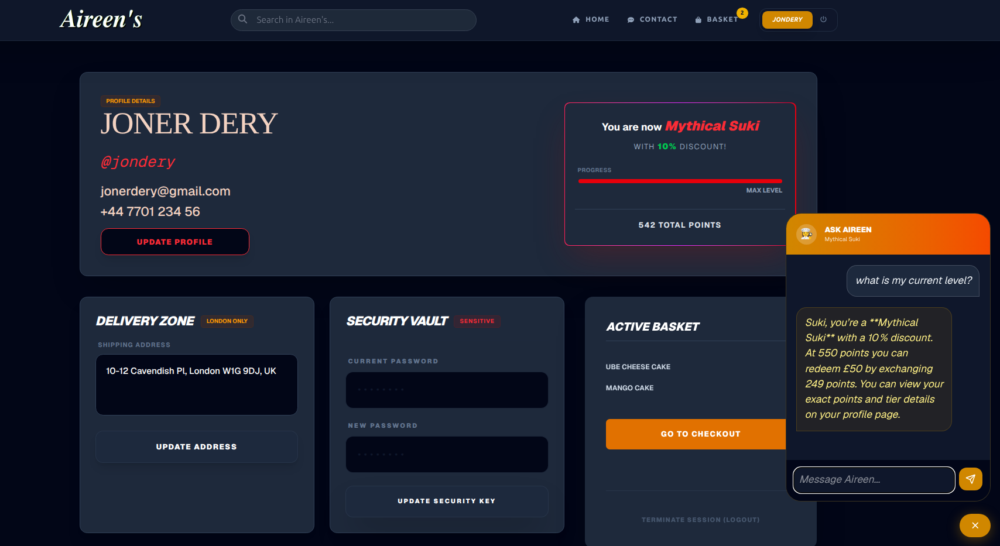
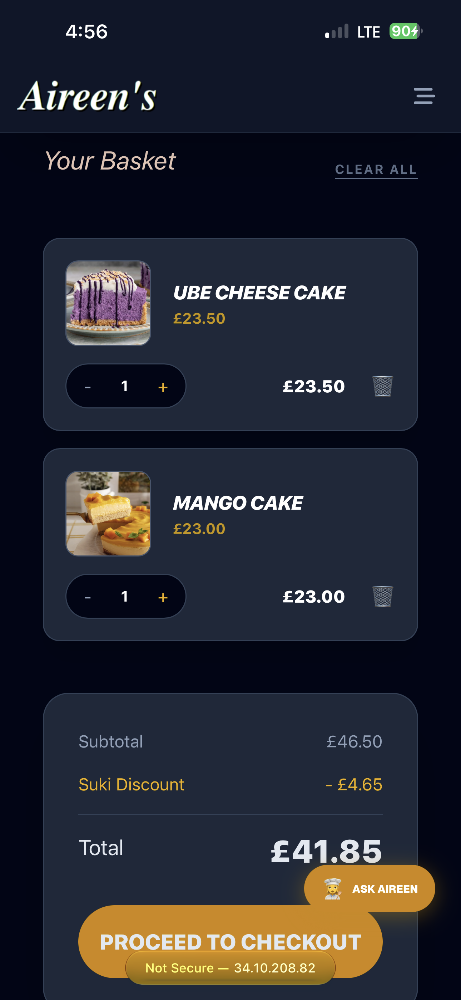
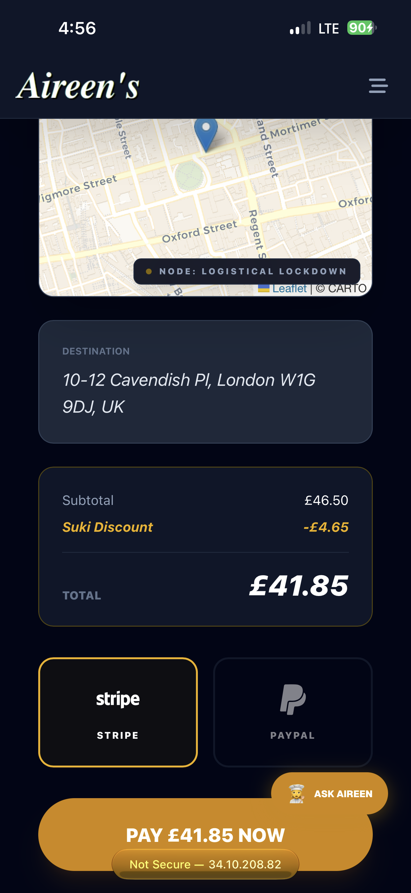
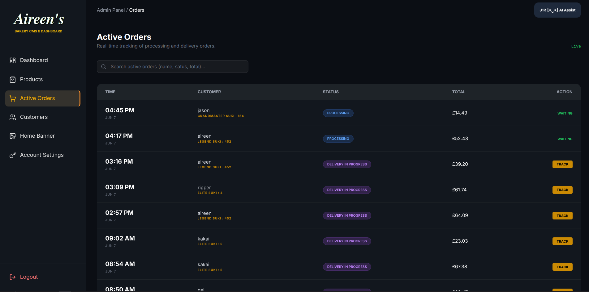
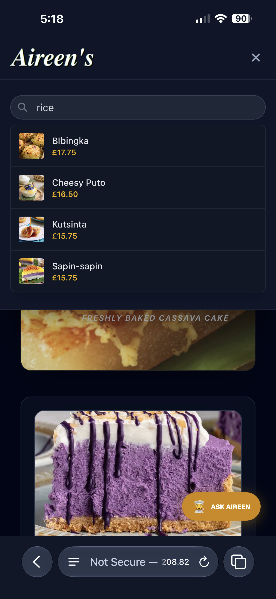
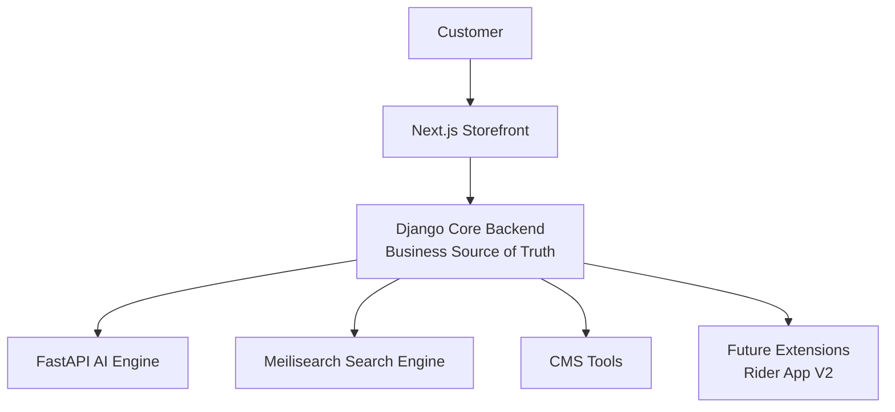
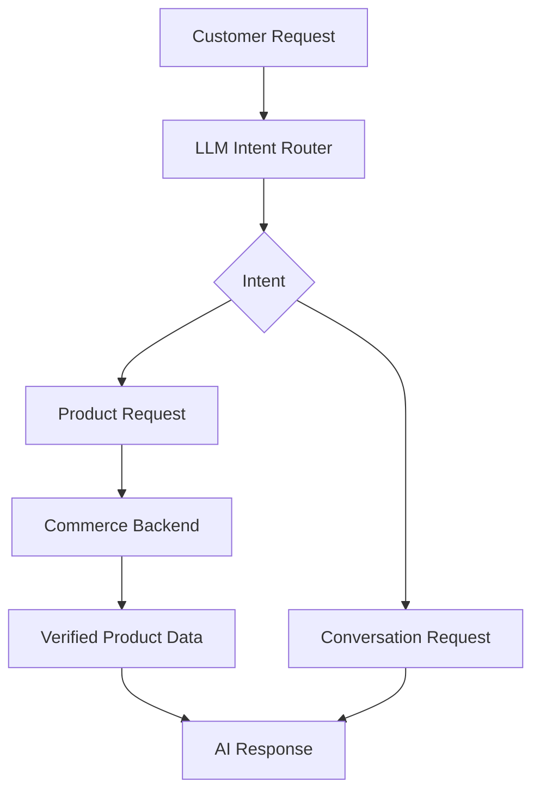

# 🏛️ AireenShop — AI Commerce Architecture Showcase

> An architecture showcase of a real-world AI-powered commerce ecosystem built for a bakery business.

---

# 🧠 Overview

AireenShop is an AI-native commerce platform designed and developed for a Filipino bakery operating in London.

It combines:

- Modern web technologies
- AI reasoning systems
- Product intelligence
- Loyalty gamification
- Payment workflows
- Operational tools

into a unified digital commerce ecosystem.

AireenShop follows a core principle:

> AI should enhance commerce, not replace the foundation that makes commerce reliable.

The platform separates:

- Business truth
- Customer experience
- AI intelligence
- Specialized capabilities

allowing AI capabilities to evolve while keeping business operations stable.

---

## License

This repository is provided for portfolio and educational review purposes.

The documentation, architecture diagrams, and showcase materials are protected intellectual property and may not be reused without permission.

See [LICENSE](LICENSE) for details.

---

# 📌 About This Repository

This repository is an **architecture showcase** for AireenShop.

It documents:

- Customer experience design
- Tindera AI behavior and architecture
- SHAMM architecture philosophy
- Backend engineering decisions
- Frontend engineering decisions
- Deployment strategy
- Responsible AI design principles

The production source code remains private because AireenShop was developed for a real business and contains client-owned intellectual property.

This repository focuses on the architecture, engineering decisions, and technical principles behind the platform without exposing the production codebase.

---

# 🌐 Live Demo

Experience the running AireenShop AI commerce ecosystem:

🔗 http://34.10.208.82

Bootstraps the Tindera AI assistant session and provisions a sandbox customer profile.

Test Credentials: username: demo / passwd: demo

## Demo Environment

The showcase environment provides a pre-authenticated customer experience so visitors can explore AireenShop without creating an account.

The demo account has standard customer permissions only and cannot access:

- Administrative features
- CMS tools
- Business management functions

The live showcase demonstrates:

- Next.js storefront experience
- Django commerce backend
- FastAPI AI orchestration
- Tindera AI assistant integration
- Authenticated customer journey
  
Explore:

- 🤖 Ate Aireen Digital Tindera
- 🧁 AI-powered product discovery
- 🛒 Shopping cart experience
- 🎮 Suki Tier loyalty system
- 💳 Checkout workflow

---

# 📸 Platform Preview

## 🤖 Ate Aireen — Digital Tindera Experience



Ate Aireen provides a conversational shopping experience designed around the familiar Filipino tindera interaction model.

The AI assistant helps customers discover products while remaining grounded in verified commerce data.

---

## 🧁 AI Product Discovery



Customers can discover bakery products through natural language conversations instead of relying only on traditional keyword search.

---

## 🧠 Context-Aware Recommendations



Ate Aireen considers customer preferences and constraints to provide relevant recommendations while following commerce rules.

---

## 🎮 Suki Tier Loyalty Experience



The Suki Tier system transforms customer activity into a long-term loyalty experience.

---

## 🛒 Customer Commerce Journey





The storefront provides a complete customer journey from product discovery to checkout.

---

## ⚙️ Commerce Operations



Behind the customer experience, AireenShop includes operational tools supporting real commerce workflows.

---

## 🔎 Product Intelligence



Meilisearch provides fast product discovery while Django remains the source of truth for commerce data.

---

# 🏛️ SHAMM Architecture Philosophy

AireenShop follows a custom architecture approach:

## SHAMM

**Self-Healing, Agentic, Modular Monolith Monorepo**

SHAMM combines:

- Modular monolith stability
- Specialized capability services
- AI-assisted intelligence
- Controlled communication boundaries

Core principle:

> Centralize business truth.  
> Decentralize specialized capabilities.

---

# 🧩 Architecture Overview



AireenShop is not designed as a traditional distributed microservice system.

Instead, it uses:

- A centralized commerce core
- Specialized capability services
- Controlled communication boundaries

This provides flexibility without unnecessary system complexity.

---

# 🔒 Core Architecture Rule

Every specialized service communicates through the Django Core Backend.

Django owns:

- Business logic
- Data validation
- Commerce decisions
- Customer transactions
- Application rules

Specialized services provide:

- AI reasoning
- Search intelligence
- Operational assistance

Benefits:

- Clear ownership boundaries
- Easier maintenance
- Safer evolution
- Reduced complexity

---

# 🛠️ Technology Stack

## Frontend

- Next.js
- TypeScript
- Zustand

## Backend

- Django
- Django Ninja
- PostgreSQL production design
- SQLite development environment

## AI Services

- FastAPI AI Orchestrator
- GPT-OSS-120B storefront AI
- GPT-OSS-20B CMS AI

## Search

- Meilisearch

## Infrastructure

- Google Cloud Platform
- Nginx
- Systemd services

---

# 🤖 AI Commerce Ecosystem

AireenShop does not treat AI as a simple chatbot.

Instead, AI is integrated as an intelligent commerce layer.



AI provides intelligence.

The backend controls execution.

---

# 👩‍🍳 Ate Aireen — Digital Tindera Experience

Ate Aireen is AireenShop's AI bakery assistant.

The goal is not to create a generic chatbot.

The goal is to recreate the familiar experience of a helpful Filipino tindera:

- Warm
- Respectful
- Patient
- Helpful
- Honest

Ate Aireen helps customers:

- Discover products
- Understand options
- Receive recommendations
- Navigate shopping decisions

The focus is not only answering questions.

It is creating a comfortable customer relationship.

---

# 🛡️ Responsible AI Boundaries

Ate Aireen follows strict commerce rules.

The AI:

✅ Uses real backend data  
✅ Uses confirmed products  
✅ Explains available information  
✅ Assists customer decisions  

The AI does not:

❌ Invent products  
❌ Create fake prices  
❌ Claim unavailable items exist  
❌ Override business rules  

The backend remains the final authority.

This separation allows AI creativity while protecting commerce accuracy.

---

# 🧠 Dual AI Engine Strategy

AireenShop uses specialized AI models based on responsibility.

## Storefront AI Brain

### GPT-OSS-120B

Used for customer interaction.

Responsibilities:

- Shopping conversations
- Product discovery
- Recommendations
- Natural language understanding

---

## CMS AI Brain

### GPT-OSS-20B

Used for internal operations.

Responsibilities:

- CMS assistance
- Content generation
- Administrative support
- Business insights

Different problems receive different intelligence engines.

---

# 🔎 Product Intelligence Layer

AireenShop combines AI conversation with instant product discovery.

Technology:

- Django Product System
- Meilisearch Search Engine

Traditional commerce:

```text
Customer
   |
Keyword Search
   |
Product Results
```

AireenShop:

```text
Customer

   |
Natural Request

   |

Ate Aireen AI
        +
Instant Search

   |

Real Product Data

   |

Commerce Backend
```

AI understands.

Search retrieves.

Backend validates.

---

# 🎮 Suki Tier Loyalty Ecosystem

AireenShop introduces gamified customer relationships.

The Suki Tier system transforms customers from one-time buyers into long-term community members.


Tier examples:

- Elite Suki
- Master Suki
- GrandMaster Suki
- Legend Suki
- Mythical Suki

The goal:

Create customer relationships, not only transactions.

---

# 💳 Commerce Foundation

AireenShop includes:

- Product management
- Cart system
- User accounts
- Authentication
- Checkout workflows
- Payment integrations

Payment testing includes:

- Stripe sandbox
- PayPal sandbox

The commerce foundation remains the source of truth.

---

# ⚡ Performance & Deployment Philosophy

AireenShop was designed with resource awareness.

Validated environment:

```text
Google Cloud e2-micro

2 vCPU
1GB RAM
```

The architecture prioritizes:

- Efficient services
- Clear boundaries
- Controlled resource usage
- Practical scalability

The goal:

> Quality comes from good engineering decisions, not only expensive infrastructure.

---

# 🚀 V2 Roadmap

Future expansion includes:

### J1R CMS AI Assistant

Extending AI capabilities within the administration platform:

**Capabilities:**
- SEO assistance
- Product description generation
- Media analysis
- Business insights
- Content optimization
- Administrative workflow automation

---

### Rider App

Extending the ecosystem into delivery operations:

**Capabilities:**
- Order fulfillment
- Rider workflow management
- Delivery tracking
- Status synchronization
- Route and assignment management

---

### Infrastructure Improvements

Improving deployment reliability, scalability, and operational efficiency:

**Planned:**
- Docker containerization
- GitHub Actions CI/CD pipeline
- Automated build and deployment workflows
- Redis caching
- Celery background processing
- CDN integration
- Search optimization
- Environment-based configuration management
- Production monitoring and logging

---

### Platform Evolution

Long-term enhancements based on business growth and operational requirements:

**Future Considerations:**
- Multi-tenant architecture
- Advanced analytics and reporting
- AI-assisted business intelligence
- Horizontal scaling strategies
- High-availability deployment architecture

---

# 🏗️ Engineering Highlights

✅ Real-world AI commerce platform  
✅ Customer-focused experience design  
✅ SHAMM architecture  
✅ Modular monolith approach  
✅ AI-native commerce workflow  
✅ Dual AI engine strategy  
✅ Ate Aireen Digital Tindera  
✅ Intent-driven AI routing  
✅ Product-grounded AI responses  
✅ Meilisearch product intelligence  
✅ Suki Tier loyalty system  
✅ Backend source-of-truth architecture  
✅ Secure authentication design  
✅ Payment workflow integration  
✅ Resource-aware deployment strategy  
✅ Responsible AI guardrails  

---

# 🌱 Vision

AireenShop demonstrates how small businesses can combine:

- Modern software architecture
- Responsible AI
- Customer loyalty systems
- Intelligent automation
- Human-controlled workflows

AireenShop is not just an online bakery.

It is a foundation for an AI-powered commerce ecosystem.

---

# 📚 Documentation

Detailed architecture and engineering documents:

1. [Customer Experience](docs/01-customer-experience.md)
2. [Tindera AI Design](docs/02-tindera-ai-design.md)
3. [SHAMM Architecture](docs/03-shamm-architecture.md)
4. [Engineering Decisions - Backend](docs/04-engineering-decisions-backend.md)
5. [Engineering Decisions - Frontend](docs/05-engineering-decisions-frontend.md)
6. [Deployment Strategy](docs/06-deployment-strategy.md)
7. [AI Safety and Guardrails](docs/07-ai-safety-and-guardrails.md)
