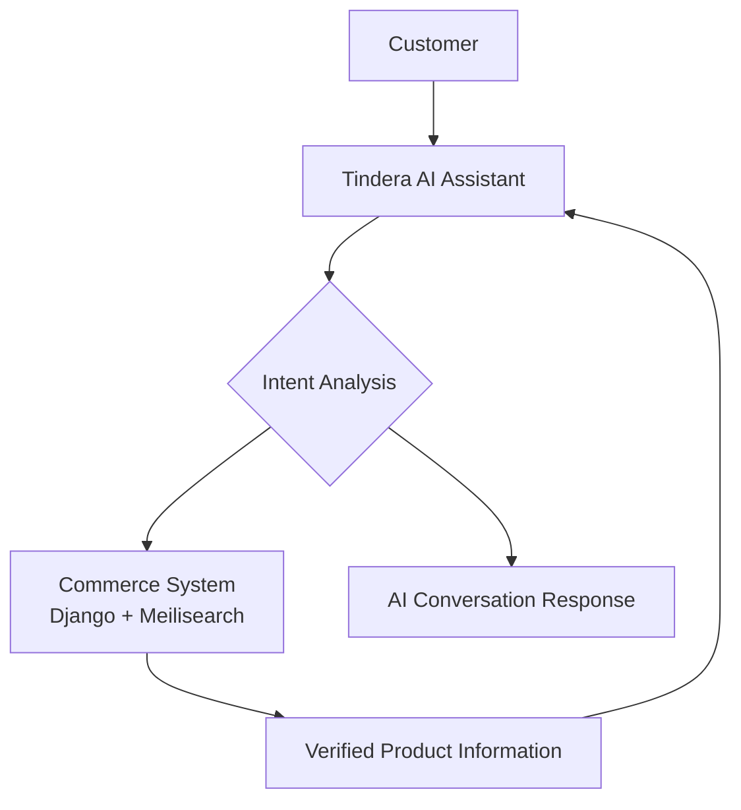
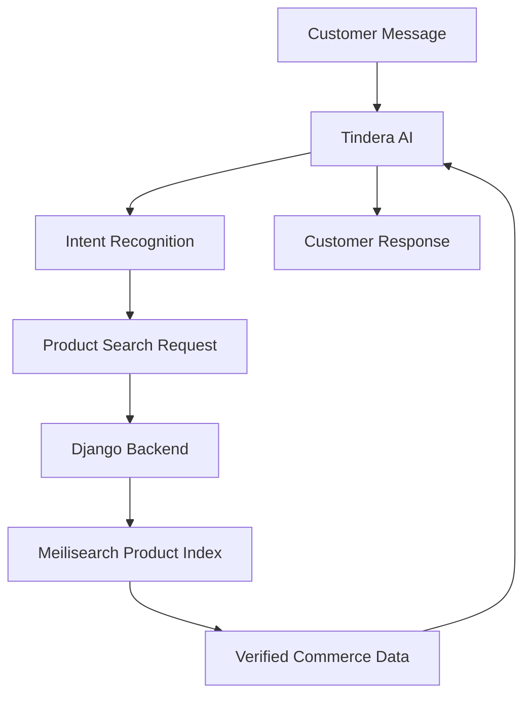
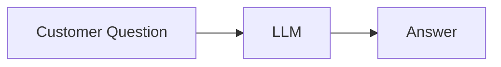
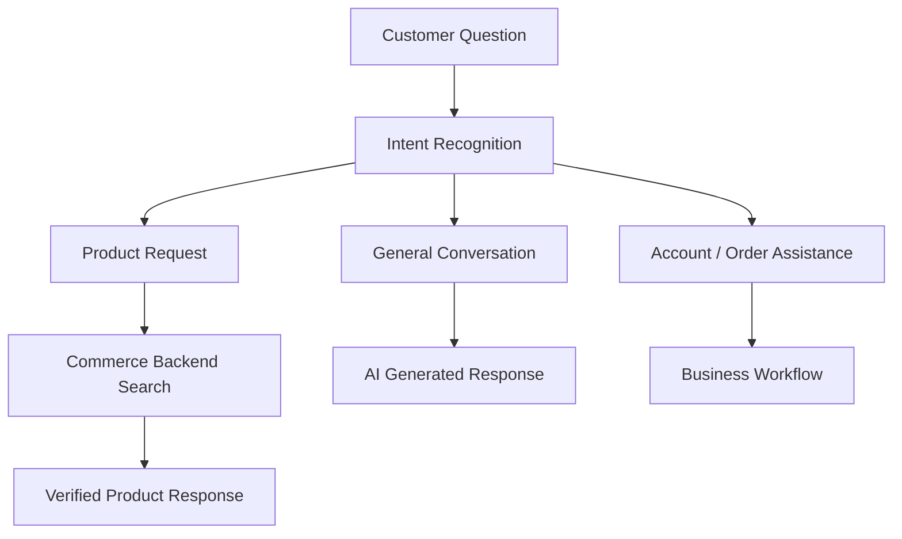
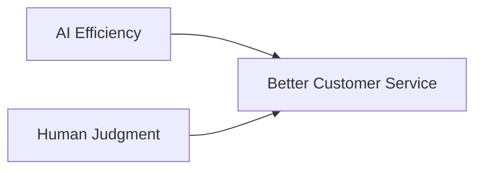

# AI Safety and Guardrails: Designing a Trustworthy Commerce Assistant

## Overview

Large language models provide powerful conversational capabilities, but building an AI assistant for commerce requires more than connecting an LLM to a storefront.

In an e-commerce environment, AI responses can directly influence customer decisions. Incorrect information about products, pricing, availability, or promotions can negatively affect customer trust and business reputation.

AireenShop was designed around a simple principle:

> AI should enhance the customer experience while the commerce platform remains the source of truth.

The goal was not to create a general-purpose chatbot.

The goal was to create a **trustworthy digital tindera** — an AI assistant that is helpful, conversational, and aligned with real business data.

---

# 1. AI Should Assist, Not Replace the Commerce System

A common AI architecture mistake is allowing the language model to become the source of truth.

This introduces risks:

- hallucinated products
- incorrect prices
- outdated promotions
- unavailable items being recommended
- inaccurate customer guidance

AireenShop separates AI capabilities from commerce responsibilities.



The AI understands customer intent, but product truth comes from the commerce backend.

---

# 2. Domain-Limited AI Behavior

Tindera is intentionally designed as a domain-specific assistant.

Her responsibilities include:

- bakery product discovery
- product availability questions
- pricing assistance
- promotions
- ordering guidance
- loyalty program information
- customer support interactions

She is not designed to answer every possible question.

This limitation is intentional.

A specialized AI assistant with clear boundaries is more reliable than a general AI system that confidently provides incorrect information.

Example:

Customer:

> "Can you help me find today's pastries?"

Tindera:

> "Of course! I can help you check our available pastries and recommend some favorites."

The assistant stays within the bakery domain where it can provide reliable value.

---

# 3. The "Never Invent Products" Rule

One of the most important guardrails in AireenShop is:

> Tindera must never invent products.

Large language models are designed to generate natural responses. However, this same capability can create plausible but incorrect information.

In commerce, this behavior is unacceptable.

Example:

Customer:

> "Do you have strawberry chocolate croissants?"

Unsafe response:

> "Yes! We have strawberry chocolate croissants available."

The problem:

The customer may expect a product that does not exist.

---

A safer Tindera response:

> "I couldn't find that item in our current menu. I can help you check our available pastries or recommend something similar."

The assistant remains friendly while protecting product accuracy.

---

# 4. Separation Between AI Intelligence and Business Data

The AI layer is responsible for understanding and conversation.

The commerce layer is responsible for business truth.



## AI Layer Responsibilities

Handles:

- natural language understanding
- customer intent recognition
- conversational responses
- personality behavior

## Commerce Layer Responsibilities

Handles:

- products
- prices
- availability
- customer accounts
- orders
- loyalty points

This architecture prevents the AI from becoming an uncontrolled database.

---

# 5. Intent Recognition Before Action

A safer AI commerce workflow does not send every request directly to an LLM response.

Instead, requests are classified before actions are performed.

Traditional chatbot approach:



AireenShop approach:



Examples:

Customer:

> "Do you have cinnamon rolls?"

Detected intent:

```
PRODUCT_SEARCH
```

Action:

```
Query commerce system
Retrieve verified products
Generate response
```

Customer:

> "Thank you Ate Aireen!"

Detected intent:

```
GENERAL_CONVERSATION
```

Action:

```
Generate friendly response
```

This reduces unnecessary AI generation and improves reliability.

---

# 6. Persona Design as a Safety Layer

AI safety is not only about preventing incorrect information.

It is also about controlling how information is delivered.

Ate Aireen was designed around the personality of a helpful Filipino tindera:

- warm
- respectful
- approachable
- patient
- customer-focused

The objective is not to make the AI pretend to be human.

The objective is to create a comfortable and trustworthy customer interaction.

Example:

System-style response:

> "Product unavailable."

Tindera-style response:

> "Sorry, I couldn't find that item right now. Let me help you look for something similar."

The information is the same.

The customer experience is different.

---

# 7. Respectful Refusal Behavior

A reliable AI assistant must know its boundaries.

A refusal should protect accuracy while maintaining a positive customer relationship.

Poor refusal:

> "I cannot help with that."

Better refusal:

> "I can help you with bakery products, orders, and store questions. For other topics, I may not have the right information."

A good refusal:

- explains the limitation
- remains helpful
- preserves trust

---

# 8. Protecting Customer Trust

Commerce is built on trust.

Customers trust businesses that:

- provide accurate information
- acknowledge uncertainty
- avoid misleading answers
- communicate clearly

Tindera follows this principle:

> A helpful answer is not always the answer a customer wants. It is the answer the business can confidently support.

Accuracy comes before creativity.

---

# 9. Human Assistance Remains Important

AI is designed to reduce repetitive workload, not remove human judgment.

Some situations still require human involvement:

- complex complaints
- payment disputes
- unusual requests
- cases requiring approval

The ideal customer experience combines:



AI handles scale.

Humans handle complexity.

---

# 10. Future AI Evolution

Future AireenShop improvements may include:

- personalized recommendations
- customer preference memory
- proactive shopping assistance
- multi-agent commerce workflows
- automated business insights

However, increasing AI capability also requires stronger guardrails.

The principle remains:

> More intelligence requires more responsibility.

---

# Conclusion

Building an AI commerce assistant is not simply about connecting a language model to an online store.

The real engineering challenge is creating a system that is:

- intelligent enough to understand customers
- constrained enough to protect accuracy
- friendly enough to build relationships
- reliable enough for real commerce

Tindera is designed as a digital tindera — not just a chatbot.

It represents a balance between artificial intelligence, business rules, and human-centered customer service.